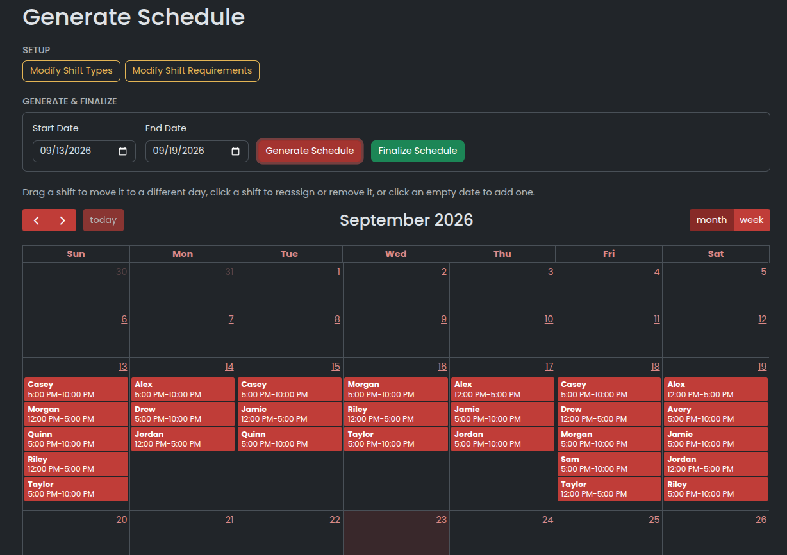

# Work Scheduler Application

A full-stack employee scheduling app built for a shift-based ice cream shop. Managers configure shifts and staffing needs, employees request time off, and the app generates a weekly schedule that respects everyone's availability and hour limits. Managers can then adjust it by hand before finalizing.



## Features

- **Automated schedule generation** for any date range, based on weekly staffing requirements.
- **Manual editing with live validation.** Drag shifts between days, reassign or remove them, or add new ones. Every edit is re-checked against the scheduling rules, and a schedule can't be finalized until it's valid.
- **Pinned shifts.** Place specific employees on shifts before generating, and the generator builds the rest of the schedule around them.
- **Time-off requests.** Employees click a date on their calendar to request off one shift or the whole day.
- **Recurring unavailability.** Managers can mark days or shifts an employee can never work.
- **Employee management.** Add, edit, and deactivate employees, and set position, wage, and weekly hour limits.
- **Shift configuration.** Define shift types (name and hours) and how many staff each day needs per shift.
- **Availability overview.** A summary of every employee's unavailability and requested days off.
- **Authentication.** Passwords are hashed with bcrypt. Logins create a random session token stored server-side and sent in an `httpOnly` cookie. All data routes require a valid session.

## How scheduling works

The generator lives in [`backend/src/schedule/scheduleGeneration.js`](backend/src/schedule/scheduleGeneration.js) and runs in four steps:

1. **Build slots.** Each day in the range is expanded into individual seats from the staffing requirements (for example, 3 people on Friday close).
2. **Order by difficulty.** Seats with the fewest eligible employees are filled first, so hard-to-cover shifts aren't left until the end.
3. **Backtracking search.** Employees are assigned seat by seat. An employee is eligible only if they are available for the shift, not already working that day, and under their weekly hour limit. Every shift (except mid shifts) must include a Shift Leader or Manager. If a seat can't be filled, earlier choices are undone and retried. If no valid schedule exists, the app reports which shift couldn't be filled.
4. **Fairness pass.** Once every seat is filled, the generator tries swapping employees between shifts on different days and keeps any swap that makes the schedule fairer: more even hours, more even weekend shifts, and fewer back-to-back workdays.

Hand edits are checked by [`validation.js`](backend/src/schedule/validation.js), which reuses the same rules as the generator. It flags double-booking, unavailability, hour limits, missing shift leaders, and shifts with too few or too many staff.

## Tech stack

| Layer      | Stack                                                   |
| ---------- | ------------------------------------------------------- |
| Frontend   | React 19, React Router, React-Bootstrap, FullCalendar, Sass |
| Backend    | Node.js, Express 5                                      |
| Database   | MySQL (mysql2)                                          |
| Auth       | bcrypt, server-side sessions, `httpOnly` cookies         |
| Validation | Zod                                                     |

## Project structure

```
backend/src/
  auth/        login, logout, session middleware
  employees/   employee CRUD
  shifts/      shift types, staffing requirements, availability, time off
  schedule/    schedule generation, validation, finalizing
  db/          connection, table setup, mock data
frontend/src/
  screens/     one folder per page
  GlobalComponents/  shared calendar, modal, sidebar
  api/         fetch helper
  util/        date, availability, and color helpers
```

## Getting started

### Prerequisites

- Node.js 18+
- MySQL

### Setup

1. Create the database:
   ```sql
   CREATE DATABASE coldstone;
   ```
2. Install dependencies from the project root:
   ```bash
   npm run install:all
   ```
3. Configure the backend:
   ```bash
   cp backend/.env.example backend/.env
   ```
   Then fill in `DB_USER` and `DB_PASSWORD`, and `DB_NAME` if you used a different name.
4. Start the API (port 5000) and the React app (port 3000):
   ```bash
   npm run dev
   ```

The backend creates its tables automatically on startup.

### Mock data

> **Warning:** with `SEED_MOCK_DATA=true` (the default), the backend **deletes all existing data** and reseeds on every startup. Set `SEED_MOCK_DATA=false` to keep your data.

The seed data includes 11 employees with varied availability, two shift types (Open 12-5 PM, Close 5-10 PM), and weekly staffing requirements.

### Demo login

| Username | Password      | Position     |
| -------- | ------------- | ------------ |
| `alex`   | `password123` | Shift Leader |
| `avery`  | `password123` | Employee     |

Every seeded user has the password `password123`. The **Dev Login** button on the login page signs in as a throwaway dev user. It only works when `NODE_ENV` is not `production`.

## Roadmap

This is an active work-in-progress. Planned next:

- Role-based access, so manager-only pages and actions are restricted to managers
- Manager approval for time-off requests
- Shift swapping between employees
- Expanded analytics (hours per employee, coverage reports)
- Automated tests for the scheduling algorithm

## AI use statement


I designed and built this application, including the architecture, database schema, API, and scheduling algorithm. I used Claude as a development tool, mainly for UI styling (theme colors, layout, and visual polish), plus debugging, code review, and some cleanup/refactoring.
